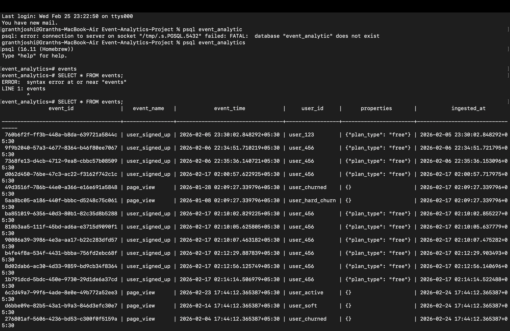

# Event Analytics Platform

An event-driven analytics system designed to model user activity, compute engagement metrics, and classify churn using a clean, append-only architecture.

This project focuses on **correct event modeling, SQL-first analytics, and analytical integrity**, not dashboards or infrastructure automation.

---

## Table of Contents

- [Overview](#overview)
- [Architecture](#architecture)
- [Core Data Model](sql/schema)
- [Ingestion Layer](ingestion)
- [Analytics Layer](sql/analytics)
- [Churn Classification](sql/analytics/churn_classification.sql)
- [Demo](#demo)
- [How to Run](#how-to-run)
- [Design Decisions & Tradeoffs](#design-decisions--tradeoffs)
- [Scope Boundaries](#scope-boundaries)
- [Project Structure](#project-structure)
- [Future Extensions](#future-extensions)

---

## Overview

Modern analytics systems are built around immutable event streams.

This project implements a simplified but production-aligned event analytics pipeline:

- Append-only event storage
- Idempotent ingestion
- SQL-defined metrics
- Retention and churn modeling
- Full metric recomputability

The system is intentionally local-first and infrastructure-light to focus on **analytical depth and data modeling correctness**.

---

## Architecture

**Architecture**

Client / Script

↓

Ingestion Layer (Python)

↓

PostgreSQL (events table)

↓

SQL Analytics Layer

↓

Insights

## Core Data Model

The system is built around a single immutable table:

`events`

- One row = one atomic action
- Append-only
- No derived state stored
- All metrics recomputable

Key columns:

- `event_id` (UUID, primary key)
- `event_name`
- `event_time`
- `user_id`
- `properties` (JSONB)
- `ingested_at`

See full schema documentation in:  
`sql/schema/`

---

## Ingestion Layer

Implemented in Python.

Responsibilities:

- Validate incoming events
- Enforce event contract
- Guarantee idempotency
- Persist immutable records

Key characteristics:

- No business logic
- No metric computation
- Strict input validation
- Safe retry handling

See: `ingestion/`

---

## Analytics Layer

All analytical intelligence lives in SQL.

Metrics implemented:

### Engagement
- Daily Active Users (DAU)
- Signup counts

### Retention
- Basic retention
- Day-1 retention
- Cohort retention

### Funnels
- Signup → Activity
- Signup → Day-1 Activity

### Churn
- Multi-window churn classification

All metrics are derived exclusively from raw events.

See: `sql/analytics/`

---

## Churn Classification

Users are categorized based on inactivity duration:

- **Active**: < 7 days inactive
- **Soft churn**: 7–13 days
- **Churned**: 14–29 days
- **Hard churn**: ≥ 30 days

Churn is inferred from inactivity — not explicit events.

This mirrors real-world product analytics practices.

churn_status | users

–––––––+—––

active       | 1

soft_churn   | 1

churned      | 1

hard_churn   | 1

---

---

## How to Run

 1. Install Dependencies

bash

    pip install -r requirements.txt

2. Configure Environment

       cp env.example .env
   Update with your PostgreSQL credentials.

3. Create Database

       createdb event_analytics

5. Apply Schema

       psql event_analytics -f sql/schema/events.sql
   
5. Ingest Test Even

         python -m ingestion.test_ingest

6. Run Analytics

          psql event_analytics
         \i sql/analytics/churn_classification.sql

## Design Decisions & Tradeoffs

**Why a Single Events Table?**

•	Simplifies modeling

•	Preserves historical truth
	
•	Avoids premature normalization
	
•	Enables recomputability

**Why SQL-First Analytics?**

•	Transparent metric definitions
	
•	Declarative logic
	
•	Easy reasoning about time
	
•	No hidden transformations

**Why No Dashboard?**

The focus is metric correctness, not visualization.

## Scope Boundaries

This project intentionally excludes:

•	Cloud deployment
	
•	Streaming systems
	
•	Scheduling/orchestration
	
•	Dashboard tools
	
•	Machine learning
	
•	Derived state tables

The goal is depth in event modeling and analytics logic.

## project structure

             Event-Analytics-Project/
             │
             ├── ingestion/
             ├── sql/
             │   ├── schema/
             │   └── analytics/
             ├── docs/
             ├── assets/
             ├── requirements.txt
             ├── env.example
             ├── CONTRIBUTING.md
             └── README.md

## Future Extensions

Possible next steps:
	•	Materialized views for heavy queries
	•	Automated metric refresh
	•	Spark-based scaling
	•	Cloud data warehouse migration
	•	ML-based churn prediction

These are intentionally separate layers.
